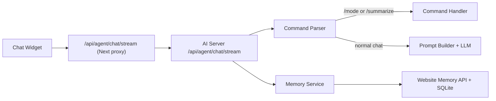

# Chat MVP 設計（角色模式 + `/summarize` + 記憶）

## 1. 目標

- 讓 chat 從「問答框」升級成「可操作工作台」。
- 先交付最小可用版本（MVP）：
  - 角色模式切換（`/mode`）。
  - 指令（`/summarize`）。
  - 長短期記憶（session + profile）。

## 2. 範圍

### In scope

- `website/components/agent-chat-widget.tsx`：新增 slash command UX、模式狀態、記憶設定入口。
- `ai/src/server.ts`：新增 command pipeline、讀寫 long-term memory。
- `ai/src/shared/agent-contract.ts` + `website/lib/agent-contract.ts`：擴充 request/response contract。
- `website` SQLite：新增 profile memory 資料表與 API。

### Out of scope（本階段不做）

- 多模型路由。
- 多租戶權限系統。
- 向量資料庫 / 大規模 RAG。

## 3. 使用者體驗

### 3.1 角色模式

- 指令：`/mode sales`、`/mode tutor`、`/mode support`、`/mode default`。
- 行為：
  - 前端先更新當前模式 chip（即時回饋）。
  - 同步送到後端，後端以 mode template 組裝 system prompt。
  - assistant 回覆一行確認訊息（例如「已切換為 tutor 模式」）。

### 3.2 `/summarize`

- 指令：`/summarize`、`/summarize 8`（數字代表最近 N 則對話）。
- 回覆格式固定四段：
  - 核心重點
  - 已決事項
  - 待辦
  - 風險/待確認
- 若歷史不足，回覆可用範圍並降級到現有歷史。

### 3.3 記憶

- 短期記憶：沿用現有 session history（server memory map）。
- 長期記憶：以 `visitorId` 對應 profile，跨 session 保存。
- 記憶內容只存「偏好與穩定背景」，不存敏感資訊。
- 前端提供「清除我的記憶」入口（呼叫 delete profile memory）。

## 4. 架構與流程

## 5. Contract 變更

### 5.1 Request

`AgentChatRequestContract` 新增欄位：

- `visitorId: string`：前端 localStorage 產生，跨 session 穩定 ID。
- `mode?: "default" | "sales" | "tutor" | "support"`。
- `command?: { name: "mode" | "summarize"; args?: string[] }`。
- `memory?: { enabled: boolean }`。

### 5.2 Response

`AgentChatResponseContract` 新增欄位：

- `mode?: string`：當前生效模式。
- `commandResult?: { name: string; ok: boolean }`。
- `memoryHints?: string[]`：例如「已記住你的語言偏好」。

## 6. 記憶資料模型（SQLite）

### 6.1 `agent_profiles`

- `visitor_id TEXT PRIMARY KEY`
- `preferred_locale TEXT`
- `preferred_tone TEXT`
- `default_mode TEXT`
- `updated_at TEXT NOT NULL`

### 6.2 `agent_profile_memories`

- `id INTEGER PRIMARY KEY AUTOINCREMENT`
- `visitor_id TEXT NOT NULL`
- `memory_key TEXT NOT NULL`
- `memory_value TEXT NOT NULL`
- `confidence REAL NOT NULL DEFAULT 0.8`
- `source TEXT NOT NULL DEFAULT 'chat'`
- `updated_at TEXT NOT NULL`
- unique index：`(visitor_id, memory_key)`

## 7. Prompt 組裝策略

- Base prompt（現有 `createSystemPrompt`）。
- Mode prompt（依 mode 套入風格與任務偏好）。
- Memory prompt（最多注入 8 條高信心記憶，超過則按 `updated_at` 截斷）。
- Safety rule：
  - 不把 token、密碼、個資寫入 long-term memory。
  - 只有「可重複使用」的偏好/背景才寫入。

## 8. Command Pipeline

### 8.1 解析順序

1. 若 message 以 `/` 開頭，先走 `parseSlashCommand`。
2. 可識別 command 則直接走 `handleCommand`，不進 LLM。
3. 無法識別 command 則回覆可用指令清單。
4. 非 command 訊息才進 `streamAgent`。

### 8.2 Handler 規格

- `mode`：
  - 驗證 mode 是否支援。
  - 更新 session mode + profile default mode。
  - 回覆確認文字與 `commandResult`。
- `summarize`：
  - 從 session history 取最近 N 則。
  - 用固定 summarizer prompt（低溫）生成四段摘要。
  - 回傳文字與 `commandResult`。

## 9. 檔案變更清單（實作階段）

- `ai/src/shared/agent-contract.ts`
- `website/lib/agent-contract.ts`
- `website/components/agent-chat-widget.tsx`
- `ai/src/server.ts`
- `ai/src/ai/action-utils.ts`
- `ai/src/ai/command-parser.ts`（新增）
- `ai/src/ai/modes.ts`（新增）
- `website/app/api/agent/memory/profile/route.ts`（新增）
- `website/lib/server/agent-memory-store.ts`（新增）

## 10. 測試矩陣

- command parsing：
  - `/mode tutor` 成功。
  - `/mode unknown` 失敗回覆。
  - `/summarize`、`/summarize 5`、`/summarize abc`。
- memory：
  - 首次 visitor 建立 profile。
  - 重開頁面仍能帶回 default mode。
  - 清除記憶後不再注入 memory prompt。
- regression：
  - `navigate/open_modal/ui/sections` 舊功能不受影響。

## 11. 分階段上線

### Phase 1（低風險，1 天）

- 合約欄位 + `/mode` 指令。
- 前端模式 chip。

### Phase 2（1~2 天）

- `/summarize` 指令。
- command pipeline 測試。

### Phase 3（2 天）

- long-term memory API + SQLite。
- 記憶注入 prompt + 清除記憶 UI。

## 12. 驗收標準（DoD）

- 使用者可在同一視窗完成模式切換與摘要，不需離開聊天。
- 同一 `visitorId` 重開頁面仍維持 default mode 與偏好。
- command 失敗時有可理解錯誤訊息，SSE 不中斷。
- 既有導頁 / modal / UI block 功能回歸測試全通過。
